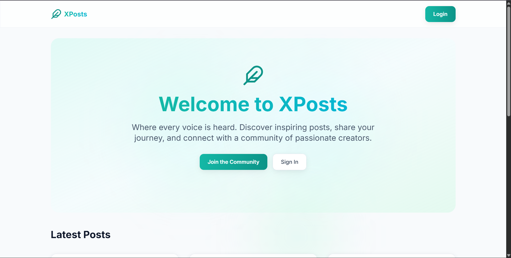
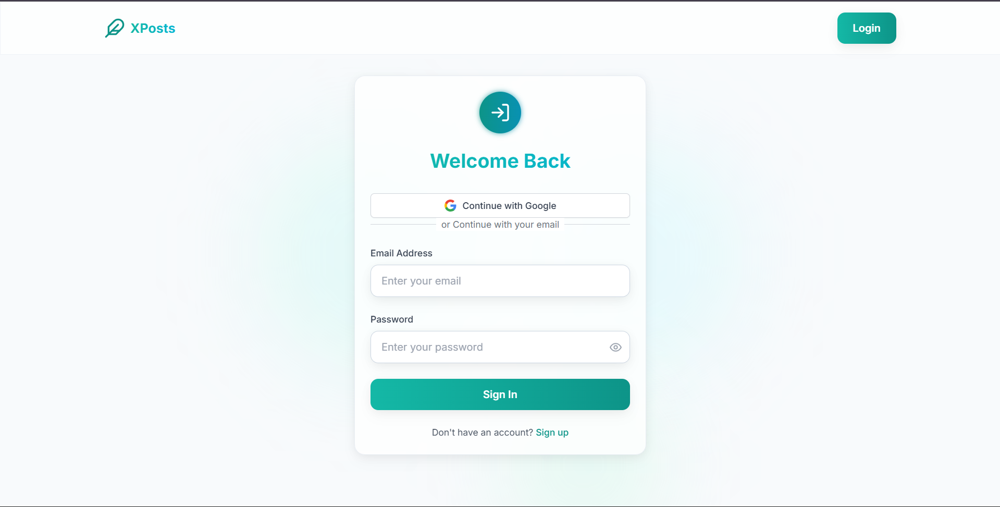
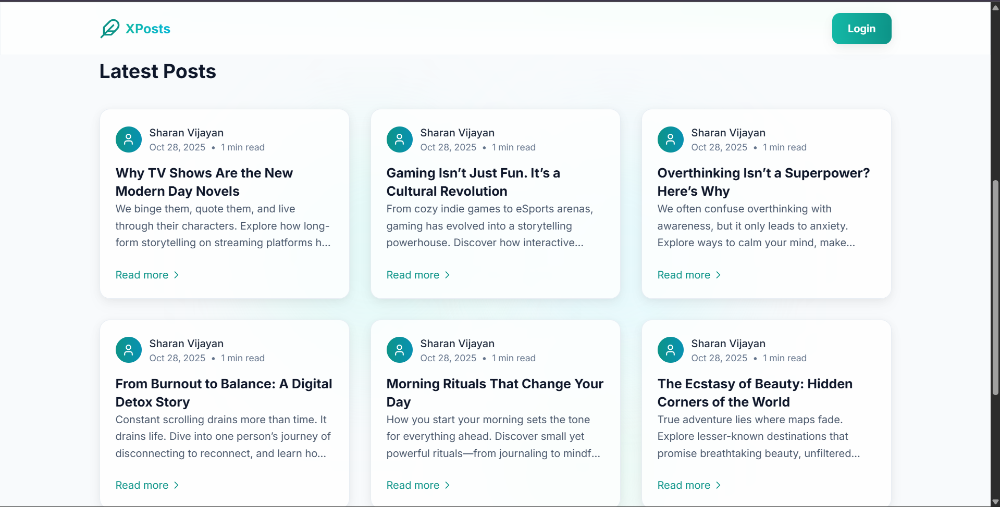

# XPosts - Full-Stack Blogging Platform

A modern, full-stack blogging application built with Next.js 14, Supabase, NextAuth.js, and Tailwind CSS.

## Screenshots

Here are some key screenshots showcasing the application's features and user interface:

### Home Page

*Beautiful landing page with gradient design and post listings*

### Login Page

*Clean login interface with Google OAuth integration*

### All Posts View

*Responsive grid layout displaying all blog posts*

### Create Post

*Rich post creation form with preview functionality*

### Update Post

*Edit existing posts with the same intuitive interface*

### Delete Post

*Confirmation dialog for post deletion with safety measures*

## Features

- **Dual Authentication**: Email/password and Google OAuth
- **Blog Management**: Create, read, update, and delete blog posts
- **User Profiles**: User registration and profile management
- **Modern UI**: Responsive design with Tailwind CSS
- **Secure**: JWT tokens and Row Level Security (RLS)
- **Fast**: Built with Next.js 14 App Router
- **Mobile-Friendly**: Fully responsive design

## Tech Stack

- **Frontend**: Next.js 14, React 18, Tailwind CSS
- **Backend**: Next.js API Routes
- **Database**: Supabase (PostgreSQL)
- **Authentication**: NextAuth.js + Custom JWT
- **Styling**: Tailwind CSS
- **Icons**: Lucide React
- **Forms**: React Hook Form
- **Notifications**: React Hot Toast

## Quick Start

### Prerequisites

- Node.js 18+ 
- npm or yarn
- Supabase account

## Project Structure

```
├── src/
│   ├── app/                    
│   │   ├── api/               
│   │   │   ├── auth/          
│   │   │   └── posts/         
│   │   ├── login/             
│   │   ├── register/          
│   │   ├── create/            
│   │   ├── posts/             
│   │   ├── layout.js          
│   │   ├── page.js            
│   │   └── globals.css        
│   ├── components/            
│   │   ├── Navbar.js          
│   │   ├── PostCard.js        
│   │   ├── PostForm.js        
│   │   └── Providers.js       
│   ├── contexts/              
│   │   └── AuthContext.js     
│   └── lib/                   
│       ├── auth.js            
│       ├── supabase.js        
│       └── validation.js      
├── database/
│   └── schema.sql             
├── public/                    
├── scripts/
│   └── setup.js              
└── package.json
```

## Authentication Flow

The app supports two authentication methods:

1. **Email/Password**: Traditional registration and login
2. **Google OAuth**: Sign in with Google account

Both methods integrate seamlessly and provide JWT tokens for API access.

## Database Schema

The application uses the following main tables:

- **users**: User accounts and profiles
- **posts**: Blog posts with author relationships

## Created by Sharan Vijayan